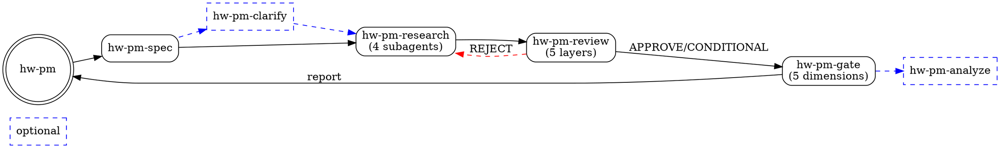

# hw-pm Skills for OpenCode

## 安装方法

### 方式一：Plugin（推荐）

在 `opencode.json` 中添加以下一行：

```json
{
  "plugin": ["hw-pm-skills@git+https://github.com/<你的GitHub用户名>/hw-pm-skills.git"]
}
```

OpenCode 会自动克隆仓库并注册 7 项 hw-pm 技能。

### 方式二：手动配置

克隆仓库到本地后，在 `opencode.json` 中添加：

```json
{
  "skills": {
    "paths": ["./path/to/hw-pm-skills/skills"]
  }
}
```

### 验证

启动 OpenCode 后，用 `skill` 工具列出现有技能：

```
Use the skill tool to list available skills.
Expected: 7 hw-pm skills (hw-pm, hw-pm-spec, hw-pm-clarify, hw-pm-research,
          hw-pm-review, hw-pm-gate, hw-pm-analyze)
```

---

## 技能工作流



| 技能 | 类型 | 输入 | 输出 |
|------|------|------|------|
| `hw-pm` | 入口 | 产品想法 | 阶段路由 |
| `hw-pm-spec` | 必需 | 产品一句话 | project.yaml, 阈值 |
| `hw-pm-clarify` | 可选 | 模糊的需求 | 澄清后的 spec |
| `hw-pm-research` | 必需 | spec + 配置 | 4×MD + 4×JSON |
| `hw-pm-review` | 必需 | 调研产出 | discussion.md, 就绪度 |
| `hw-pm-gate` | 必需 | review + 产出 | gate_review.md, Go/No-Go |
| `hw-pm-analyze` | 可选 | gate 产出 | audit_report.md |

## 工具映射

| 技能中引用的工具 | OpenCode |
|:---|:---|
| `Task` 派发子 agent | `Task` 工具，`subagent_type: general` |
| `TodoWrite` 创建检查清单 | `todowrite` 工具 |
| web_search | 平台提供的 web 搜索工具 |
| read_file / write_file | `Read` / `Write` 工具 |
| financial_calc | 由 agent 自行计算 |

## 依赖

- **无外部依赖。** 所有技能自包含，不依赖 superpowers 或其他插件。
- 可与 superpowers 共存：两个插件同时安装时互不冲突。

## 发布流程

```bash
# 1. 创建 GitHub 仓库
# 2. 推送到远程
git remote add origin git@github.com:<用户名>/hw-pm-skills.git
git push -u origin main

# 3. 其他人安装时在 opencode.json 中添加：
#    "plugin": ["hw-pm-skills@git+https://github.com/<用户名>/hw-pm-skills.git"]
```
