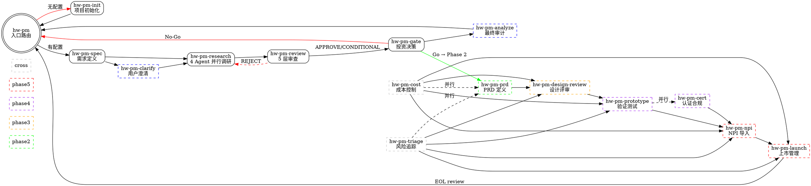

# PRD: 硬件产品经理多智能体工作流系统 (hw-pm)

## Problem Statement

硬件产品经理的核心工作是从投资决策角度判断一个产品是否值得投入资源。然而现有决策流程依赖分散的邮件、表格和会议，决策依据缺乏统一的数据溯源和量化标准。产品经理需要同时处理市场调研、竞品分析、成本估算、财务建模等多维度信息，工作量大且容易遗漏关键因素。

需要一套以"产品即投资品"为核心理念的多智能体工作流系统，自动执行硬件产品开发流程，产出结构化的决策依据。

## Solution

`hw-pm-skills`，将硬件产品开发流程编码为 agent 可执行的技能（skills）。Agent 通过加载技能自动执行工作流。

核心理念从"构建一个 AutoGen 多智能体应用程序"转变为 **"教会 agent 如何做硬件产品管理"**。每一份 SKILL.md 就是一份 agent 可直接遵循的操作手册。

## 技能体系（Delivered）

### 18 Skills Overview (Phase 1-5)

### 技能清单

| 技能 | Phase | 职责 | 核心机制 |
|------|-------|------|----------|
| `hw-pm` | 入口 | 状态路由、阶段调度、角色定义 | 文件系统状态机 + phase_status |
| `hw-pm-init` | 入口 | 目录创建、模板生成、字段填写 | 模板覆盖 + 交互式填充 |
| `hw-pm-spec` | 1 | 三级配置继承、投资阈值 | company → product_line → project 合并 |
| `hw-pm-clarify` | 1 | 调研前消除需求歧义 | 单轮单问、多选优先、澄清日志 |
| `hw-pm-research` | 1 | 4 Agent 并行调研 | Task 派发 + prompt 模板 + 矛盾仲裁 |
| `hw-pm-review` | 1 | 5 层完备性审查 | REJECT/CONDITIONAL/APPROVE |
| `hw-pm-gate` | 1 | 5 维度量化投资决策 | 置信度折衷 + 用户确认 |
| `hw-pm-analyze` | 1 | 最终一致性审计 | 只标记不修改 |
| `hw-pm-prd` | 2 | PRD + 技术规格 + 功能排序 | MoSCoW + effort/impact 矩阵 |
| `hw-pm-design-review` | 3 | ID/MD/EE/FW 多轮设计评审 | Design Scorecard + 问题追踪 |
| `hw-pm-prototype` | 4 | EVT/DVT/PVT 验证管理 | 阶段 exit criteria + 缺陷趋势 |
| `hw-pm-cert` | 4 | 认证与合规跟踪 | 认证矩阵 + 偏差管理 |
| `hw-pm-npi` | 5 | 制造就绪与试产 | NPI 清单 + 供应商评估 + 爬坡计划 |
| `hw-pm-launch` | 5 | 上市与售后管理 | 定价、渠道、RMA、上市后复盘 |
| `hw-pm-cost` | 2-5 | BOM 成本管控 | Should-cost + cost-down 路线图 |
| `hw-pm-triage` | 2-5 | 风险与问题追踪 | 三防机制（Prevent/Detect/Correct） |

## User Stories

1. 作为产品经理，我想用一条命令初始化产品项目并继承公司的战略和投资阈值配置，以便快速启动分析而不必每次都重新输入基础信息
2. 作为产品经理，我只输入产品的一句话描述，系统就能并行调度市场分析师、用户研究代理和商业分析师同步开展调研工作，以便节省串行调研的时间
3. 作为产品经理，我期望市场分析师自动搜索竞品信息并生成结构化的竞品分析报告，以便我快速了解竞争格局
4. 作为产品经理，我期望商业分析师根据产品规格自动估算单台 BOM 成本和建立单位经济模型，以便我在概念阶段就能判断财务可行性
5. 作为产品经理，我期望产出物中每个数据点都标注置信度（high/medium/low）和来源，以便我知道哪些结论是可靠的、哪些需要人工进一步核实
6. 作为产品经理，我期望系统在 Phase 1 完成后自动执行 Gate Review，按量化维度（市场规模、NPV、毛利、风险敞口、战略匹配）输出 Go/No-Go 判决，以便我做出有数据支撑的投资决策
7. 作为产品经理，我可以在每个关键决策点（如 Gate Review、高成本影响决策）暂停并确认，以便我在重要节点保留最终决策权
8. 作为产品经理，我可以配置公司级战略信息（如公司战略要点、毛利率底线、投资阈值），这些信息自动被所有项目继承，以便保证战略一致性
9. 作为产品经理，我可以按产品线定义默认配置（品牌定位、价格带、关键竞品），新项目只需选择产品线即可继承这些设定
10. 作为产品经理，我可以通过 `hw-pm status` 查看当前项目的阶段进度、产出物列表和 Gate 评审结果，以便掌握项目整体状态
11. 作为产品经理，我期望所有 agent 的完整对话日志被持久化保存，以便事后审计决策过程和追溯每个结论的来源
12. 作为产品经理，当市场分析师和商业分析师给出相反建议时，产品总监能根据数据置信度或配置中的硬约束做出仲裁，以便及时推进决策而非陷入僵局
13. 作为产品经理，我期望产出物有明确的版本管理（文件快照 + changelog），后续阶段发现问题可以回溯发起修改请求，以便支持产品开发的迭代特性
14. 作为产品经理，我可以自定义产出物模板（竞品分析、PRD、Gate Report 等）来适配组织内部的标准格式，系统内置默认模板作为开箱即用的起点
15. 作为产品经理，我可以选择不同 LLM 模型分配给不同 agent（如关键决策用 Claude Opus，批量调研用 Claude Haiku），以便在成本和产出质量之间取得平衡
16. 作为产品经理，Phase 1 完成后如果投资决策为 No-Go，系统能清晰列出每一项不达标的维度和具体数据依据，以便我向管理层汇报终止决策的理由

## 工作流设计

### 入口路由（hw-pm）

- 检查文件系统状态来判断当前阶段
- 路由到对应子技能：`hw-pm-spec` → `hw-pm-clarify?` → `hw-pm-research` → `hw-pm-review` → `hw-pm-gate` → `hw-pm-analyze?`
- 维护全局角色表和阶段间的硬门禁

### Spec-Driven Development（hw-pm-spec）

- 三级配置继承：`company.yaml` → `product_line.yaml` → `project.yaml`
- 定义产品一句话描述、公司战略要点、投资阈值、评估维度
- 硬门禁检查清单：所有必填字段完成才能进入调研

### 用户澄清（hw-pm-clarify，可选）

- 在 spec 存在多义性时触发（描述模糊、价格范围未定义、竞品未指定等）
- 一次只问一个问题，多选优先
- 记录澄清日志到 project.yaml 的 `clarification_log` 字段

### Phase 1 并行调研（hw-pm-research）

- 当前 agent 作为 Squad Lead，派发 4 个子 agent：
  - **战略规划师**：战略匹配评分、路线图影响、蚕食风险
  - **市场分析师**（工具：web_search, read_file）：竞品分析、TAM/SAM/SOM、市场趋势
  - **用户研究员**：用户画像、痛点排行、JTBD
  - **商业分析师**（工具：financial_calc, read_file）：BOM、单位经济模型、NPV/IRR、盈亏平衡
- 每个子 agent 的 prompt 自包含，包含角色定义、上下文、产出要求、自检清单
- 输出：8 个文件（4 Markdown + 4 JSON），均含 confidence + source 标注

### 5 层完备性审查（hw-pm-review）

- Layer 1：流程合规 — 工作流是否正确执行
- Layer 2：产物完整 — 所有文件是否存在且格式正确
- Layer 3：数据覆盖 — 每份报告是否满足最低要求
- Layer 4：交叉一致 — 不同 agent 结论是否矛盾
- Layer 5：就绪度 — 综合评定 REJECT / CONDITIONAL / APPROVE
- 输出：discussion.md（含置信度矩阵、数据缺口、矛盾清单、假设验证表）

### 投资决策门禁（hw-pm-gate）

- 5 维度评分：市场吸引力（25%）、财务健康（25%）、毛利率（15%）、风险敞口（15%）、战略匹配（20%）
- 置信度折衷：high → 1.0×、medium → 0.85×、low → 0.7×
- 加权 PASS ≥ 60% → Go
- 输出：gate_review.md，呈报用户最终确认
- No-Go 时列出每一项不达标维度的具体数据和阈值差距

### 最终审计（hw-pm-analyze，可选）

- 高价值项目或面向管理层汇报时触发
- 4 维度审计：交叉一致性、来源可追溯性、格式完备性、假设合理性
- 审计报告只标记不修改，保留原始产出完整性

## Agent 工具权限

| Agent | 工具 | 读权限 |
|-------|------|--------|
| 战略规划师 | 无 | project.yaml, company.yaml |
| 市场分析师 | web_search（Firecrawl）、read_file | project.yaml, company.yaml, product_line.yaml |
| 用户研究员 | 无 | project.yaml, company.yaml |
| 商业分析师 | financial_calc（NPV/IRR/TAM 计算）、read_file | project.yaml, company.yaml |
| Squad Lead（当前 agent） | read_file、write_file、Task 派发子 agent | 全部产出物 |

### 数据可信度

- 每个 JSON 数据点标注 `confidence`（high|medium|low）和 `source`
- 低置信度数据在 Gate Review 中降低该维度的决策置信度（0.7× 乘数）

### 产出物格式

- 调研/分析类 agent（市场分析师、用户研究员、商业分析师）：Markdown + JSON 双输出
- 决策类 agent（战略规划师）：Markdown 输出
- 综合审查（产品总监）：discussion.md
- 决策类（产品总监）：gate_review.md
- 审计类（产品总监）：audit_report.md

### 冲突解决

- 数据驱动：双方各自给出数据依据，比较置信度
- 阈值判决：以配置中硬约束为仲裁标准（如毛利率底线）
- 呈报用户：数据不足或战略级分歧，归档双方论点，暂停等待人工裁定

### 任务完成判定

- 每个 task 预设结构化要求（章节、最小字数、必须表格、必须引用来源等）
- Agent 完成任务后自检 checklist，全部满足则标记完成
- 超最大轮次未完成则 Squad Lead 接管（重新派发或人工介入）

## 配置体系

- 三级配置继承：公司级 (`company.yaml`) → 产品线级 (`product_line.yaml`) → 项目级 (`project.yaml`)
- 公司级配置包含：公司战略要点、默认投资阈值、行业领域、合规要求
- 产品线级配置包含：品牌定位、目标毛利率、默认价格带、关键竞品
- 项目级仅填写差异化信息：项目名、产品一句话描述
- 配置以本地 YAML 文件存储，不使用数据库
- LLM 模型配置由用户在配置文件中自行指定，skills 不做硬编码绑定

## 版本管理

- 文件快照方式（如 prd_v1.md, prd_v2.md）配合 changelog.yaml 记录变更原因
- 不使用 Git（skills 仓库本身用 Git 管理，但项目产出物用快照方式）

## Out of Scope

- Web 界面
- 项目管理者 Dashboard 和自动风险预警
- 与外部企业系统（ERP/PLM）的对接
- 多项目并发执行
- 联网实时查询元器件价格
- 多语言支持

## Further Notes

- 支持 OpenCode、Claude Code、Codex 等主流 agent 平台
- 16 项技能覆盖从项目初始化到产品上市的完整硬件生命周期（Phase 1-5），含并行和 cross-phase 技能
- 技能按线性+并行混合组织：入口 → (init?) → spec → (clarify?) → research → review → gate → Phase 2 → Phase 3 → Phase 4 (含并行 cert) → Phase 5
- 每个技能自包含，无外部依赖，修改或扩展只需编辑/新增 SKILL.md
- 推荐使用支持 Tool-use 的模型（Claude 系列、DeepSeek 等），但 skills 本身模型无关
- 仓库包含 OpenCode plugin（`.opencode/plugins/hw-pm.js`），一行配置即可安装
