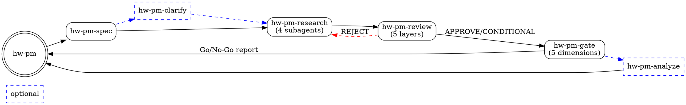

# hw-pm-skills

Hardware product manager multi-agent skills for AI coding assistants.

Treats products as **investments**. Each initiative follows a structured lifecycle of phases and gates — every phase produces decision-grade data, every gate applies quantified criteria before capital is committed.

## Quick Start

```json
{
  "plugin": ["hw-pm-skills@git+https://github.com/visioner3d/hw-pm-skills.git"]
}
```

Restart OpenCode and load the entry skill:

```
Use the skill tool to load hw-pm
```

## Skills

| Skill | Type | Description |
|-------|------|-------------|
| `hw-pm` | Entry | State routing, phase dispatch, role definitions |
| `hw-pm-spec` | Required | Config inheritance, investment thresholds, templates |
| `hw-pm-clarify` | Optional | Resolve spec ambiguities with user before research |
| `hw-pm-research` | Required | Dispatch 4 parallel subagents (strategy, market, user, finance) |
| `hw-pm-review` | Required | 5-layer completeness review before gate |
| `hw-pm-gate` | Required | 5-dimension quantified investment decision |
| `hw-pm-analyze` | Optional | Final consistency audit for management-bound outputs |

## Workflow



## Requirements

- An AI coding assistant with `skill` tool support (OpenCode, Claude Code, Codex, etc.)
- LLM with web search and tool-use capabilities for the research phase

## Installation

See [`.opencode/INSTALL.md`](.opencode/INSTALL.md) for detailed setup instructions.

## License

MIT
