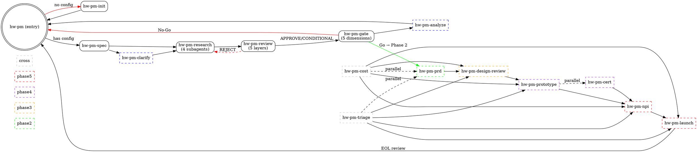

# hw-pm-skills

Hardware product manager multi-agent skills for AI coding assistants.

Treats products as **investments**. Each initiative follows a structured lifecycle of phases and gates — every phase produces decision-grade data, every gate applies quantified criteria before capital is committed.

## Quick Start

```json
{
  "plugin": ["hw-pm-skills@git+https://github.com/visioner3d/hw-pm-skills.git"]
}
```

Restart OpenCode and load the entry skill:

```
Use the skill tool to load hw-pm
```

Then `hw-pm` auto-detects project state and routes to the correct skill. New projects go through `hw-pm-init` first.

## Skills

| Skill | Phase | Description |
|-------|-------|-------------|
| `hw-pm` | Entry | State routing, phase dispatch, role definitions |
| `hw-pm-init` | Entry | Quick project initialization |
| `hw-pm-spec` | 1 | Config inheritance, investment thresholds |
| `hw-pm-clarify` | 1 | Resolve spec ambiguities (optional) |
| `hw-pm-research` | 1 | 4 parallel subagents (strategy, market, user, finance) |
| `hw-pm-review` | 1 | 5-layer completeness review |
| `hw-pm-gate` | 1 | 5-dimension quantified investment decision |
| `hw-pm-analyze` | 1 | Final consistency audit (optional) |
| `hw-pm-prd` | 2 | PRD, technical spec, feature prioritization |
| `hw-pm-design-review` | 3 | Multi-round ID/MD/EE/FW design review |
| `hw-pm-prototype` | 4 | EVT/DVT/PVT validation management |
| `hw-pm-cert` | 4 | Certification & compliance tracking (optional) |
| `hw-pm-npi` | 5 | Manufacturing readiness & pilot run |
| `hw-pm-launch` | 5 | Go-to-market, channel, support setup |
| `hw-pm-cost` | 2-5 | BOM cost-down & should-cost analysis |
| `hw-pm-triage` | 2-5 | Risk register, issue tracker, ECO log |

## Workflow



## Requirements

- An AI coding assistant with `skill` tool support (OpenCode, Claude Code, Codex, etc.)
- LLM with web search and tool-use capabilities for the research phase

## Installation

See [`.opencode/INSTALL.md`](.opencode/INSTALL.md) for detailed setup instructions.

## License

Apache 2.0
