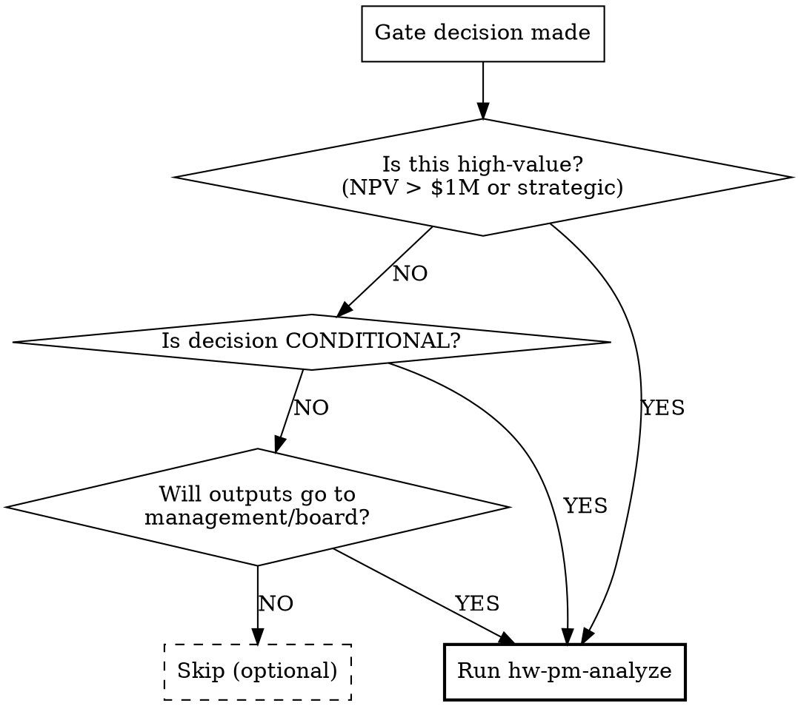

# Final Audit (hw-pm-analyze)

## Overview

This skill performs a **pre-delivery quality audit** on all Phase 1 outputs after a gate decision. It reads every artifact, cross-checks consistency, traces sources, and produces an audit report.

Unlike `hw-pm-review` which checks *readiness to decide*, `hw-pm-analyze` checks *readiness to present*. It catches embarrassing inconsistencies before outputs reach management.

## When to Use



**Don't use when:**
- Gate returned REJECT (review was skipped — go fix the issue first)
- The project is exploratory / low-stakes
- You personally wrote every output and can vouch for consistency

## Audit Dimensions

### 1. Cross-Consistency Audit

Read every output file and check for contradictions missed by review:

```
[ ] TAM value in competitive_analysis.json matches TAM discussed in discussion.md
[ ] ASP in business_case.md matches price positioning in competitive_analysis.md
[ ] User persona demographics match target market in strategy_alignment.md
[ ] BOM total in business_case.json matches BOM line items sum
[ ] NPV/IRR in business_case.json matches business_case.md
[ ] All currency references use same unit (USD unless specified)
[ ] No contradictory statements about the same topic across different files
```

### 2. Source Traceability Audit

For every cited source:

```
[ ] Published sources have enough detail to locate (report name, publisher, date)
[ ] URLs are from authoritative domains (not random blogs for critical data)
[ ] Self-calculated values are labeled as "calculation" or "derived"
[ ] No circular references (Agent A cites Agent B which cites Agent A)
```

### 3. Format & Completeness Audit

```
[ ] All confidence values use only "high"/"medium"/"low" (no undefined levels)
[ ] No files contain placeholder text ("TBD", "TODO", "more research needed")
[ ] JSON files are structurally valid and follow expected schema
[ ] File naming follows convention: lowercase_with_underscores
[ ] Gate report references match actual Phase 1 outputs
```

### 4. Assumption Reasonableness Audit

```
[ ] Year 1 unit sales volume realistic for the price band
[ ] BOM cost plausible for the feature set described
[ ] Growth rates consistent with market trends
[ ] No assumption contradicts another assumption across agents
```

## Audit Report Format

Write to `artifacts/audit_report.md`:

```markdown
# Audit Report: {project_name}

**Gate Decision:** {Go/No-Go}
**Audit Date:** {date}

## Summary
{Pass / Issues Found / Failed}

**Issues by Severity:**
- 🔴 Blocking: {N}
- 🟡 Warning: {N}
- ⚪ Info: {N}

## Issues Found

### 🔴 {ID}: {Title}
- **File:** {path}
- **What:** {description of the issue}
- **Impact:** {why it matters}
- **Recommendation:** {how to fix}
- **Severity:** Blocking / Warning / Info

## Files Audited
- [x] competitive_analysis.md / .json
- [x] user_research.md / .json
- [x] business_case.md / .json
- [x] strategy_alignment.md
- [x] discussion.md
- [x] gate_1_review.md
```

## Important: Audit Does NOT Modify Outputs

The audit report is **separate from** the Phase 1 artifacts and gate report.

- DO NOT edit any Phase 1 or gate files based on audit findings
- DO write issues in the audit report with specific file + line references
- DO flag issues as 🔴 blocking / 🟡 warning / ⚪ info
- DO include a recommendation for each issue

This preserves the integrity of the original outputs. If issues need fixing, the revision goes through a new iteration, not inline edits.

## Common Mistakes

**Auditing and editing simultaneously:** Finding a TAM error and fixing it in the original file. → Write the issue. The original outputs are immutable once audited.

**Audit scope creep:** Auditing code quality, prompt quality, or agent performance. → This skill audits PRODUCT outputs, not process quality.

**Skipping on high-value projects:** "It passed review, it'll pass audit." → Review and audit check different things. Review checks readiness to decide; audit checks readiness to present.

**Re-doing review work:** Re-checking Layer 1-3 items that review already validated. → Layer 1-3 are review's domain. Audit focuses on cross-consistency, traceability, and presentation quality.
