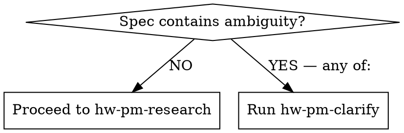

# User Clarification for Hardware PM (hw-pm-clarify)

## Overview

Ambiguity in the product spec multiplies when dispatched to 4 parallel research agents. Each agent makes different assumptions about the same fuzzy description, producing inconsistent outputs that waste review time. Clarify before parallelizing.

This skill eliminates ambiguity through structured user interaction before costly research begins.

## When to Use



Ambiguity exists when any of these are true:

- **Description has multiple interpretations** — "a better device for professionals" (which professionals?)
- **Price range undefined** — no default_price_band in config
- **Competitors not specified** — key_competitors is empty
- **Threshold mismatch** — default thresholds don't match this product category
- **Known trade-offs** — e.g., cost vs. features, speed vs. precision
- **Industry/category unclear** — which market does this compete in?

**Don't use when:**
- Spec is complete and unambiguous (proceed directly to research)
- You need to redefine company strategy (that's a business decision, not a clarification)

## Interaction Protocol

1. **Identify ambiguities** — scan spec against the trigger list above
2. **Ask one question at a time** — never batch multiple questions
3. **Prefer multiple choice** — offer 2-4 concrete options rather than open-ended
4. **Record decision** — update project.yaml with clarified value + add `clarified_by` annotation
5. **Loop** — ask next question until no ambiguities remain
6. **Pass control** — append clarification log to spec, proceed to `hw-pm-research`

```
Good: "The description says 'for professionals'. Which vertical?
  A) Industrial manufacturing / factory automation
  B) Medical / healthcare
  C) Scientific research labs"

Bad: "Can you define the price range, competitors, and vertical all at once?"
```

## Clarification Types

| Ambiguity | Question Format | Output Update |
|-----------|----------------|---------------|
| Multi-interpretation description | "Which of these best describes the product?" | Rewrite description |
| Missing price band | "What price range does this compete in?" | Set default_price_band |
| No competitors listed | "Who are the top 2-3 competitors in this space?" | Fill key_competitors |
| Misaligned thresholds | "The default TAM threshold is $100M. Is this appropriate for this product category?" | Override threshold |
| Trade-off | "The current BOM allocation can't support both feature X and target margin. Which is higher priority?" | Add trade-off note |
| Unclear industry | "Which market does this product primarily serve?" | Set industry |

## Clarification Log Format

```yaml
clarification_log:
  - field: "description"
    original: "a better device for professionals"
    clarified: "High precision 3D line laser scanner for industrial manufacturing"
    user_choice: "A) Industrial manufacturing"
    timestamp: "2026-06-07T10:00:00Z"
  - field: "default_price_band"
    original: null
    clarified: [200, 600]
    user_choice: "Manually entered $200-$600"
    timestamp: "2026-06-07T10:01:00Z"
```

## Output

A clarified `project.yaml` where:
- All ambiguous fields are replaced with precise values
- A `clarification_log` array is appended (not merged into main fields)
- The spec is ready for `hw-pm-research`

## Common Mistakes

**Batching questions:** "Price, competitors, and vertical?" → User feels overwhelmed, answers degrade. One at a time.

**Persuading:** "Don't you think $200-$600 is the right range?" → You clarify, not advise. Present options neutrally.

**Filling gaps with assumptions:** "The user didn't specify competitors, I'll use the default." → That's the ambiguity you're here to resolve. Ask the user.

**No log:** Asking questions but not recording the decisions. → Clarification log is the output artifact. Without it, you haven't done clarify.
