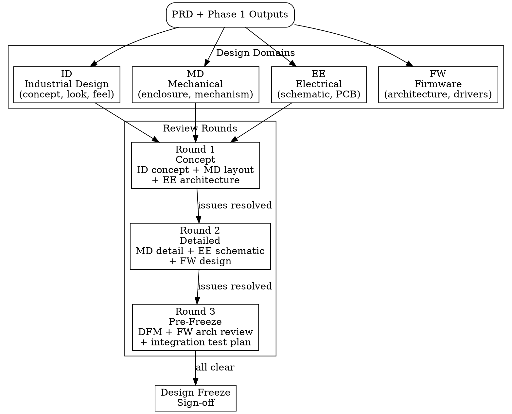

# Design Review Management (hw-pm-design-review)

## Overview

This skill manages the **design phase** of a hardware product — from concept exploration through detailed engineering to design freeze. It coordinates multi-round cross-functional reviews across four domains (industrial design, mechanical engineering, electrical engineering, firmware), tracks design issues to closure, and produces a formal sign-off before tooling and prototyping commitments.

`hw-pm-design-review` answers: *"Is the design ready to freeze and commit to prototyping?"*

## Phase Context

```
┌─────────────┐  ┌─────────────┐  ┌─────────────┐  ┌─────────────┐  ┌─────────────┐
│  Phase 1    │  │  Phase 2    │  │  Phase 3    │  │  Phase 4    │  │  Phase 5    │
│  Strategy   │→ │  PRD        │→ │  Design     │→ │  Prototype  │→ │  NPI &      │
│  & Research │  │  (hw-pm-prd)│  │  Review     │  │  & Validate │  │  Launch     │
│ (spec→gate) │  │             │  │ (this skill)│  │ (hw-pm-     │  │ (future)    │
│             │  │             │  │             │  │  prototype) │  │             │
└─────────────┘  └─────────────┘  └─────────────┘  └─────────────┘  └─────────────┘
```

Entry gate: Phase 1 Gate = "Go", PRD complete, `phase_status = "design"`
Exit gate: Design freeze signed off by all domain leads

## When to Use

- PRD is complete, Phase 1 Gate was "Go"
- `phase_status` in project.yaml is "design"
- Engineering resources are identified (ID/MD/EE/FW leads)
- Need to track design maturity across multiple review rounds

**Don't use when:**
- PRD is still in research or review phase (finish Phase 1 first)
- No engineering leads assigned for the review domains
- Product is purely software (no hardware design)

## Preconditions

Before launching, ensure these exist:

```
[ ] project.yaml with phase_status = "design"
[ ] Phase 1 outputs complete (spec + gate decision = Go)
[ ] Key design constraints extracted (size, power, precision, cost)
[ ] Engineering leads identified per domain
```

## Domain Architecture



## Design Scorecard

Create a per-domain scorecard at the start of Phase 3. Track it throughout the review cycle.

| Domain | Target | Current | Gap (%) | Trend | Last Updated |
|--------|--------|---------|---------|-------|-------------|
| **ID** | Concept approval | — | —% | — | — |
| **MD** | Enclosure fits BOM + size target | — | —% | — | — |
| **EE** | Schematic review pass | — | —% | — | — |
| **FW** | Architecture review pass | — | —% | — | — |

**Gap interpretation:**
- 0-10%: On track, minor refinements
- 10-25%: Needs attention, schedule impact possible
- >25%: Critical, may require spec adjustment or escalation

## Review Round Structure

### Round 1 — Concept Design Review

**Purpose:** Establish design direction and identify feasibility risks early.

**Inputs:**
- ID concept renderings or sketches (2-3 directions)
- MD layout feasibility (rough envelope, material assumptions)
- EE architecture (block diagram, key component selection)
- FW architecture (high-level block diagram, MCU selection, interface list)

**Review checklist:**
```
[ ] ID concept aligns with brand positioning and price tier
[ ] Envelope dimensions accommodate PCBA + battery + interface
[ ] Key EE components selected (MCU, sensor, power IC)
[ ] FW architecture viable (RTOS vs bare-metal, comm protocol)
[ ] No impossible constraints identified
```

**Output:** `design_review_log.md` — Round 1 section with decisions and open issues.

### Round 2 — Detailed Design Review

**Purpose:** Verify engineering completeness before committing to prototypes.

**Inputs:**
- ID final surface model (CAD or STEP)
- MD detailed model (tolerance stack, DFM inputs)
- EE schematic (complete, with component BOM)
- FW detailed design (driver interfaces, state machine, memory map)

**Review checklist:**
```
[ ] ID surface model accepted (no further cosmetics changes expected)
[ ] MD tolerance stack analysis completed
[ ] EE schematic reviewed (component availability verified)
[ ] FW memory map fits selected MCU (< 80% utilization)
[ ] Inter-domain interfaces documented (connectors, signal mapping)
```

**Output:** `design_review_log.md` — Round 2 section. Updated `design_issues.md`.

### Round 3 — Pre-Freeze Review

**Purpose:** Clear remaining blockers, verify manufacturability, and confirm integration plan.

**Inputs:**
- ID final approval (color, texture, finish samples)
- MD DFM analysis report
- EE layout review (critical nets, thermal management)
- FW integration test plan (hardware-in-loop test scenarios)

**Review checklist:**
```
[ ] DFM report reviewed — no Red Flag items
[ ] EE layout passes thermal simulation (or has mitigation)
[ ] FW integration test plan covers all IO interfaces
[ ] All inter-domain interface specs signed off
[ ] Prototype BOM ready for procurement lead times
```

**Output:** `design_review_log.md` — Round 3 section. Final `design_issues.md`.

## Issue Tracking

Every review round produces issues. Use this format:

```markdown
### ISSUE-{N}: {Short Title}

- **Domain:** ID / MD / EE / FW / Cross
- **Severity:** P0 (blocking) / P1 (major) / P2 (minor)
- **Owner:** {lead name}
- **ETA:** {date}
- **Status:** Open / In Progress / Resolved / Closed
- **Round found:** 1 / 2 / 3
- **Description:** {what was found}
- **Resolution:** {what was done to close}
- **Verified by:** {who confirmed closure}
```

**Severity definitions:**
| Severity | Meaning | Action |
|----------|---------|--------|
| P0 | Blocks design freeze or prototyping | Must resolve before next round |
| P1 | Significant risk to cost/schedule/quality | Must have mitigation plan before next round |
| P2 | Cosmetic or nice-to-have | Track, resolve at lead's discretion |

**Issue lifecycle:**
1. Logged during review with severity
2. Assigned to domain lead with ETA
3. Tracked in `design_issues.md`
4. Closed only after verification (not self-verified by owner)
5. P0s validated in next round review before proceeding

### Common Issue Patterns

| Pattern | Domain | Typical Severity | Typical Fix |
|---------|--------|-----------------|-------------|
| ID-MD envelope conflict | Cross | P1 | Trade cosmetics for manufacturability |
| Component lead time > schedule | EE | P0 | Substitute or respin |
| Thermal hotspot on PCB | EE | P1 | Redo layout, add heatsink |
| FW memory overflow | FW | P0 | Optimize code or upgrade MCU |
| ID finish incompatible with plastic | Cross | P1 | Adjust finish spec or material |
| Connector placement blocked by MD | Cross | P0 | Redesign bracket or reroute |
| DFM feature impossible at target $ | MD | P1 | Simplify part, adjust cost target |

## Design Freeze Sign-Off

Before declaring design freeze, collect sign-off from each domain lead:

```markdown
# Design Freeze Sign-Off

**Project:** {project_name}
**Date:** {date}

## Domain Sign-Offs

| Domain | Lead | Status | Signature | Date | Notes |
|--------|------|--------|-----------|------|-------|
| ID | {name} | [ ] Approved | — | — | |
| MD | {name} | [ ] Approved | — | — | |
| EE | {name} | [ ] Approved | — | — | |
| FW | {name} | [ ] Approved | — | — | |

## Confirmation

- [ ] All P0 issues closed
- [ ] All P1 issues have mitigation plan
- [ ] Scorecard gaps ≤ 10% across all domains
- [ ] DFM report reviewed, no Red Flags
- [ ] Prototype BOM ready for procurement
- [ ] Inter-domain interface spec frozen
```

## Output Format

Write to `artifacts/phase_3/` (create directory if not present):

| File | Content | Required |
|------|---------|----------|
| `design_review_log.md` | Meeting minutes per round — decisions, attendees, key findings, open items | Yes |
| `design_issues.md` | Issue tracker — all issues from all rounds, current status | Yes |
| `design_freeze.md` | Sign-off checklist per domain, confirmation items | Yes |
| `dfm_report.md` | Manufacturability analysis — Red/Amber/Green items per part | If DFM completed |
| `design_scorecard.md` | Scorecard table with target vs current vs gap per domain | Yes |

### Template: design_review_log.md

```markdown
# Design Review Log: {project_name}

## Round 1 — Concept Review
**Date:** {date} | **Attendees:** {names}

### Key Decisions
- {decision 1}
- {decision 2}

### Findings
- {finding 1}
- {finding 2}

### Open Items
- {item 1}
- {item 2}

### Round 1 Summary
**Ready to proceed:** Yes / Conditional / No
**New issues opened:** {N}
**P0 issues:** {N}

---

## Round 2 — Detailed Review
...
```

### Template: design_issues.md

```markdown
# Design Issues: {project_name}

| ID | Domain | Severity | Title | Owner | ETA | Status | Round |
|----|--------|----------|-------|-------|-----|--------|-------|
| 1 | MD | P1 | Envelope interference with USB port | {name} | {date} | Open | 1 |
| 2 | EE | P0 | Voltage regulator out of stock | {name} | {date} | Resolved | 2 |

---

### ISSUE-1: Envelope interference with USB port
- Domain: MD
- Severity: P1
- Owner: {name}
- ETA: {date}
- Status: Open
- Round found: 1
- Description: USB-C connector extends 1.2mm beyond designed envelope when mated
- Resolution: Redesign side bracket to recess connector 1.5mm
- Verified by: {name}

### ISSUE-2: Voltage regulator out of stock
...
```

## Hard Gate Checklist

```
[ ] Design Scorecard established with all 4 domains
[ ] Minimum 2 review rounds completed (concept + detailed)
[ ] All P0 design issues closed
[ ] All P1 issues have documented mitigation plan
[ ] Scorecard gaps ≤ 10% across all domains
[ ] DFM report has no Red Flag items
[ ] Inter-domain interface spec frozen
[ ] Design freeze signed off (ID/MD/EE/FW leads)
[ ] Prototype BOM ready for procurement
[ ] **Limiting Factor identified:** What is the single bottleneck that determines the design freeze date?
[ ] User confirmed, phase_status updated to "validate"
```

## Questions to Ask Your Domain Experts

As the PM, your value is not in answering every technical question — it is in asking the right ones. Before signing off on each review round, ask these questions to the respective domain lead. Listen for hedging, hand-waving, or deflection.

### Industrial Design (ID)
- "If we had to cut the BOM by 15%, which ID elements would you sacrifice first?"
- "What surface finish or material choice are you least confident about for mass production?"
- "Show me the worst-case tolerance stack on the most visible cosmetic seam."

### Mechanical Engineering (MD)
- "What's the one part you'd bet will fail first in reliability testing?"
- "At this wall thickness and material, can the tool fill completely in under 2 seconds?"
- "If the enclosure needs to grow by 3mm in any dimension, which direction costs us the least?"

### Electrical Engineering (EE)
- "Which component on the BOM has the worst availability outlook over the next 18 months?"
- "What is the thermal margin on the hottest component at worst-case ambient + full load?"
- "If we need to cut power consumption by 20%, where would you start?"

### Firmware (FW)
- "What hardware bug would be hardest to work around in firmware?"
- "If the MCU family is discontinued mid-project, how many months to port?"
- "Which sensor or peripheral has the least mature driver support?"

### Cross-Domain
- "What's the one thing the other domain doesn't understand about your constraints?"
- "If we had to ship 3 months earlier, what would you cut — and what would break?"

These questions do not replace formal review checklists. They supplement them with PM judgment.

## Common Mistakes

**Skipping concept review:** Going straight to detailed design because "we know what we want." → Concept review catches fundamental errors before engineering invests in detail. Never skip it.

**Soft close on issues:** "We discussed it and agreed to fix it later." → Issues must have owner, ETA, and verification. "Discussed" is not closed.

**Freezing with P0s:** "We'll fix it in the prototype revision." → Each prototype rev costs time and money. Freeze only when all P0s are closed.

**Missing inter-domain interfaces:** ID designs a beautiful enclosure that MD can't mold, or EE places connector where MD bracket sits. → Cross-domain interface review is mandatory in every round.

**No DFM check before freeze:** Releasing a design that can't be manufactured at the target cost. → DFM analysis is a prerequisite for Round 3.

**Scorecard not tracked:** Not updating the scorecard between rounds. → Without tracking, gaps go unnoticed until the freeze deadline.
