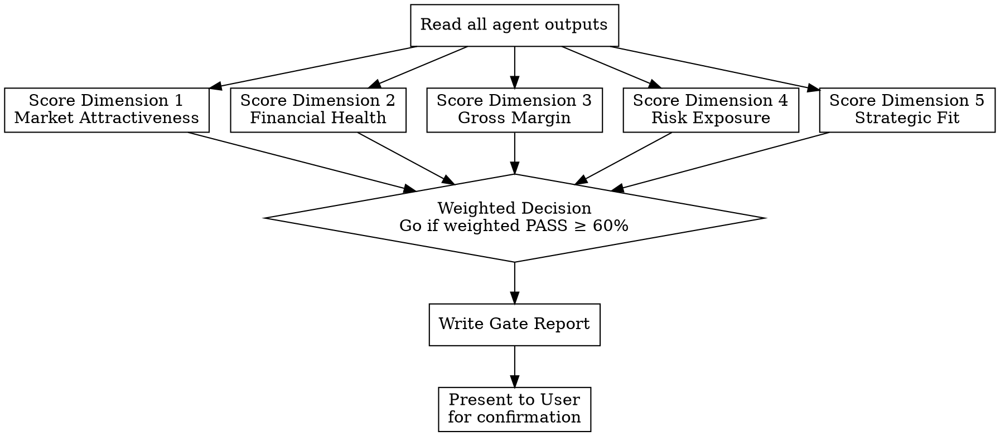

# Investment Decision Gate (hw-pm-gate)

## Overview

This skill converts Phase 1 research into a **formal investment decision**. It scores the product across 5 quantified dimensions, weights each by data confidence, and produces a Go/No-Go judgment with full traceability.

The gate is the final step before committing significant capital. It is designed to be presented to stakeholders as a defensible decision document.

## When to Use

- `hw-pm-review` returned **APPROVE** or **CONDITIONAL**
- All Phase 1 artifacts present
- No gate exists yet for this phase

**Don't use when:**
- Review returned **REJECT** (data gaps must be filled first)
- Research is incomplete
- You only need a data quality assessment (use `hw-pm-review`)

## The 5 Scoring Dimensions

| Dimension | Threshold | Data Source | Weight |
|-----------|-----------|-------------|--------|
| **Market Attractiveness** | TAM ≥ min_tam (from config) | competitive_analysis.json | 25% |
| **Financial Health** | NPV > 0 AND IRR > risk_free + premium | business_case.json | 25% |
| **Gross Margin** | margin % ≥ min_gross_margin | business_case.json | 15% |
| **Risk Exposure** | weighted risk score < max_risk_exposure | discussion.md §4 | 15% |
| **Strategic Fit** | score ≥ 3/5 (subjective) | strategy_alignment.md | 20% |

### Dimension 1: Market Attractiveness (25%)

```
Score = TAM / min_tam (capped at 1.0)
PASS  = Score ≥ 1.0
```

Business analysts may define their own thresholds and rationale, but all thresholds and rationale must be documented in the spec section.

### Dimension 2: Financial Health (25%)

```
NPV_PASS  = NPV (at company WACC) > 0
IRR_PASS  = IRR > risk_free_rate + risk_premium
PASS      = NPV_PASS AND IRR_PASS
```

Company WACC and risk premium come from `company.yaml`. Risk premium defaults to 5% if not specified.

### Dimension 3: Gross Margin (15%)

```
PASS = gross_margin_percent >= min_gross_margin
```

BOM confidence level directly affects this dimension's overall confidence.

### Dimension 4: Risk Exposure (15%)

```
Risk score = sum of (severity(1-5) × likelihood(1-5)) for each risk in discussion.md
PASS = risk_score < max_risk_exposure
```

If `max_risk_exposure` is not configured, default to 50.

### Dimension 5: Strategic Fit (20%)

```
Score = strategic_fit_score (1-5, from strategy_alignment.md)
PASS = score >= 3
```

## Confidence Discounting

Each dimension's effective score is adjusted by data confidence:

| Data Confidence | Multiplier | When Applied |
|----------------|------------|--------------|
| **high** | 1.0× | All critical data points verified (published sources, official pricing) |
| **medium** | 0.85× | Estimates based on industry data, derived calculations |
| **low** | 0.7× | Assumptions, analogies, uncited estimates |

A dimension's confidence = **minimum** confidence among its input data points.

Example:
```
TAM = $52.5B (confidence: medium) → 0.85×
Market Attractiveness Score = ($52.5B / $50M = 1.0) × 0.85 = 0.85
```

## Scoring Process



Weighted PASS = sum over dimensions of (PASS ? weight : 0), adjusted by confidence.

## Gate Report Format

Write to `artifacts/gate_reviews/gate_1_review.md`:

```markdown
# Gate 1 Review: {project_name}

**Decision: Go / No-Go** (Decision Confidence: high/medium/low)

## Market Attractiveness (TAM): PASS / FAIL
TAM: ${value}{unit} (threshold: ${threshold}{unit}), confidence: {level}
{Rationale}

## Financial Health (NPV/IRR): PASS / FAIL
NPV: ${value} (threshold: >$0), IRR: {value}% (threshold: {threshold}%), confidence: {level}
{Rationale}

## Gross Margin: PASS / FAIL
Gross margin: {value}% (threshold: {threshold}%), confidence: {level}
{Rationale}

## Risk Exposure: PASS / FAIL
Risk score: {value} (threshold: {threshold}), confidence: {level}
{Rationale}

## Strategic Fit: PASS / FAIL
Score: {value}/5 (threshold: 3/5), confidence: {level}
{Rationale}

## Summary
Gate 1 Review: {Go/No-Go} (confidence: {level}). {N}/{5} dimensions passed.

## No-Go Detail (if applicable)
| Dimension | Current State | Threshold | Gap | Data Source |
|-----------|--------------|-----------|-----|-------------|
| {dim}     | {value}      | {threshold} | {gap} | {source} |

## Final Confirmation
{Present to user: "Gate 1 recommends {Go/No-Go}. Do you confirm?"}
```

## User Confirmation Protocol

After writing the gate report:

1. **Present** the report to the user
2. **Wait** for confirmation — do not proceed without it
3. **On confirm**: archive the decision, route to next phase (or terminate for No-Go)
4. **On override**: user may override Go→No-Go or No-Go→Go. Document the override reason

## Common Mistakes

**Ignoring confidence:** Treating low-confidence data as equal to high-confidence. → Apply the discounting rules. If all data is low-confidence, decision confidence is low.

**Rubber-stamping:** "Data shows PASS in 4/5, therefore Go." → Weighted PASS may differ from raw count. A FAIL in a 25% dimension may outweigh four PASSes in 15% dimensions.

**Mixing review and gate:** Review found CONDITIONAL and you proceed to gate without documenting the conditions. → Gate report must reference the review conditions and whether they were addressed.

**No user confirmation:** Making the final call without presenting to the user. → Gate is a recommendation, not a final decision. The user owns the capital commitment.

**Unclear No-Go detail:** "Failed market attractiveness." → Must specify: the numeric value, the threshold, and the gap. The No-Go detail section exists specifically for management reporting.
