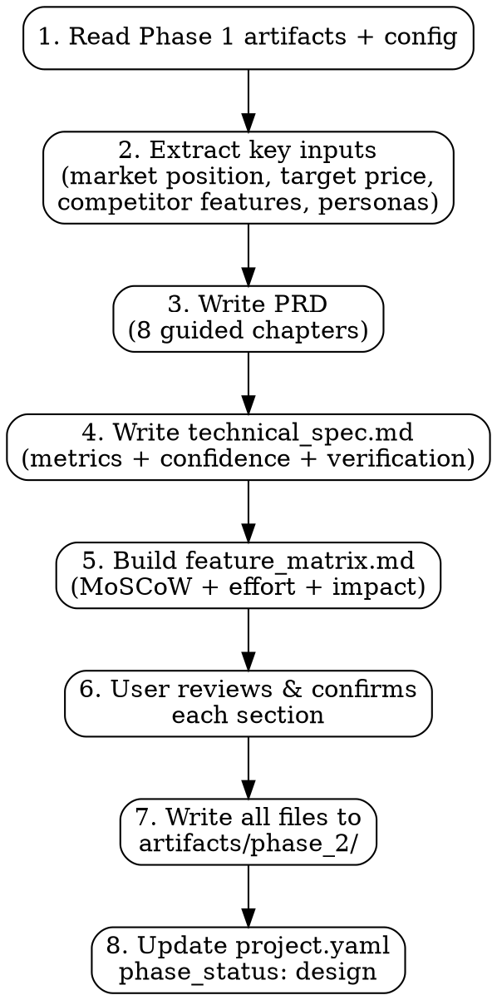

# Phase 2: Product Requirements Document (hw-pm-prd)

## Overview

This skill turns the Phase 1 investment thesis into **development-ready product documentation**. It consumes Phase 1 research outputs and the project config, then produces a structured PRD, a measurable technical specification, and a prioritized feature matrix.

Phase 2 answers: *"What exactly are we building?"*

The PRD is the authoritative reference for engineering, design, and go-to-market. Every requirement traces back to a Phase 1 finding — either a user need, a competitive gap, or a strategic objective.

## When to Use

- Phase 1 gate returned **Go** and phase_status needs advancing to `design`
- Product idea validated but needs detailed functional requirements
- Engineering and design teams need a specification to begin work

**Don't use when:**
- Phase 1 is incomplete (research, review, or gate missing)
- Gate returned No-Go (the investment thesis was rejected)
- You only need a one-page feature list (use the feature matrix alone)
- The project is pure software without hardware considerations

## Inputs

| Artifact | Format | Used For |
|----------|--------|----------|
| `project.yaml` | YAML | Product description, config, thresholds |
| `competitive_analysis.json` | JSON | Competitor feature sets, market positioning, price bands |
| `user_research.md` | Markdown | Personas, pain points, JTBD |
| `user_research.json` | JSON | Structured persona data |
| `business_case.md` | Markdown | Target BOM, ASP, margin targets |
| `strategy_alignment.md` | Markdown | Strategic positioning, risks |
| `discussion.md` | Markdown | Key assumptions, contradictions |
| `gate_1_review.md` | Markdown | Go decision rationale, conditions |

## Process



### Step 1: Read Phase 1 Artifacts

Load all Phase 1 outputs from `artifacts/phase_1_strategy/` and config files from the project root.

### Step 2: Extract Key Inputs

| Input | Source | Purpose |
|-------|--------|---------|
| Market positioning | competitive_analysis.md | Product positioning statement |
| Target price range | competitive_analysis.json + business_case.md | ASP floor for feature scoping |
| Competitor feature table | competitive_analysis.json | Must-have vs differentiator features |
| Target user personas | user_research.md + .json | Primary and secondary personas |
| Pain points (+ severity) | user_research.md | Feature requirements derived from pains |
| Target BOM | business_case.md | Cost envelope for hardware decisions |
| Strategic risks | strategy_alignment.md | Risk-mitigation requirements |
| Key assumptions | discussion.md | Assumptions to validate in spec |

### Step 3: Write PRD

Write `prd.md` to `artifacts/phase_2/prd.md` with these chapters:

```markdown
# Product Requirements Document: {project_name}

**Version:** 1.0
**Phase:** 2 (Design)
**Date:** {date}
**Status:** Draft

## 1. Executive Summary
{1-2 paragraph overview. Target audience: executives and stakeholders who need
the big picture without details. Include: what it is, why it matters, target
market, key differentiator, target price band, target ship date window.}

## 2. Background & Strategic Context
{Why this product exists. Reference Phase 1 findings:
- Strategic objective this product serves (from strategy_alignment.md)
- Market gap or opportunity (from competitive_analysis.md)
- Competitive landscape summary (key players, their positions)
- Strategic fit score and rationale from Phase 1}

## 3. Target Market
{Who this product is for:
- Market definition (TAM/SAM/SOM from competitive_analysis.json, with confidence)
- Geographic focus, vertical/industry segments
- Adoption triggers (what makes a customer buy now rather than later)
- Market growth context (relevant trends from Phase 1)}

## 4. User Personas
{Primary and secondary personas. For each:
- Name and role title
- Demographics (relevant to product decisions)
- Goals and desired outcomes
- Frustrations with current solutions
- Usage context (environment, tech literacy, purchase authority)
- Quote or scenario that captures their need
References: user_research.md personas.}

## 5. Use Cases
{≥5 use cases covering the core product experience. Each use case:
- ID: UC-{N}
- Title
- Description
- Primary persona
- Preconditions
- Main flow (numbered steps)
- Postconditions
- Priority (Critical / Important / Nice-to-have)}

### Example Use Case

| Field | Value |
|-------|-------|
| **ID** | UC-001 |
| **Title** | Operator performs in-line quality inspection |
| **Description** | A line operator places a part on the inspection station and receives a pass/fail result within 2 seconds |
| **Primary Persona** | Line Operator (Lin) |
| **Preconditions** | System calibrated; part within spec dimensions; operator trained |
| **Main Flow** | 1. Operator places part on inspection surface 2. System detects part presence 3. System triggers scan 4. System compares against reference model 5. System displays pass/fail + deviation values |
| **Postconditions** | Result logged; pass parts continue to next station; fail parts flagged for rework |
| **Priority** | Critical |

## 6. Functional Requirements
{Organized by feature area. Each requirement:
- ID: FR-{N}
- Title
- Description
- Acceptance criteria (bullet list of verifiable conditions)
- Priority: Must / Should / Could
- Traceability: links to use case(s) and/or persona
- Dependencies: other FRs or external systems}

### Example Feature Area: Measurement Engine

| ID | Title | Description | Acceptance Criteria | Priority | Traces To |
|----|-------|-------------|-------------------|----------|-----------|
| FR-001 | Part detection | System auto-detects when a part is placed in measurement zone | (1) Detection within 200ms of placement (2) Works for all part sizes in spec (3) No false triggers from operator hands | Must | UC-001 |
| FR-002 | Scan trigger | Measurement begins automatically after part detection | (1) Scan starts ≤100ms after detection confirmation (2) Operator can abort with foot switch | Must | UC-001 |

## 7. Non-Functional Requirements
{System qualities that constrain how functional requirements are delivered.

| ID | Category | Requirement | Target | Verification Method | Priority |
|----|----------|-------------|--------|-------------------|----------|
| NFR-001 | Performance | Inspection cycle time | ≤3 seconds per part | Stopwatch test, 100 cycles | Must |
| NFR-002 | Reliability | System uptime | ≥99.5% (excl. scheduled maintenance) | Log analysis over 30 days | Must |
| NFR-003 | Safety | Laser safety classification | Class 1 (eye-safe under all conditions) | Certification test | Must |
| NFR-004 | Environmental | Operating temperature range | 0°C to 50°C | Environmental chamber test | Must |
| NFR-005 | Maintainability | Mean time to repair (MTTR) | ≤30 minutes for field-replaceable units | Serviceability analysis | Should |
| NFR-006 | Usability | New operator training time | ≤2 hours to achieve basic competence | Usability study with 5 subjects | Should |

## 8. Acceptance Criteria
{High-level product acceptance criteria — the conditions the product must satisfy
to be considered complete and shippable.

1. {Criterion 1}: {condition}
2. {Criterion 2}: {condition}
3. {Criterion 3}: {condition}

These map to the Go decision criteria from Phase 1 and serve as the contract
between product management and engineering.}
```

### Step 4: Write Technical Specification

Write `technical_spec.md` to `artifacts/phase_2/technical_spec.md`:

```markdown
# Technical Specification: {project_name}

## Performance Targets

| Metric | Target | Unit | Confidence | Verification Method | Source |
|--------|--------|------|-----------|-------------------|--------|
| Inspection cycle time | ≤3 | seconds | high | Stopwatch, 100 cycles | Phase 1 user research |
| Measurement accuracy | ±0.05 | mm | medium | Gauge R&R study | Industry standard |
| Part size range (min) | 10 | mm | high | Spec from mechanical | Competitive analysis |
| Part size range (max) | 300 | mm | high | Spec from mechanical | Competitive analysis |
| System boot time | ≤30 | seconds | medium | Stopwatch | Target derived from use case |

## Interface Specifications

| Interface | Type | Protocol | Data Rate | Connector | Confidence |
|-----------|------|----------|-----------|-----------|------------|
| Host communication | Ethernet | TCP/IP Modbus | 100 Mbps | RJ-45 | high |
| Sensor interface | LVDS | Custom | 1 Gbps | Hirose DF40 | medium |
| Operator I/O | Digital | 24V PNP | — | M12 8-pin | low |

## Environmental Requirements

| Condition | Operating | Storage | Confidence | Verification |
|-----------|-----------|---------|-----------|--------------|
| Temperature | 0°C to 50°C | -20°C to 70°C | medium | Chamber test |
| Humidity | 10% to 85% non-condensing | 5% to 95% | medium | Chamber test |
| Vibration | 0.5g (10-500 Hz) | 1.5g (10-500 Hz) | low | Vibration table |
| IP Rating | IP54 | IP54 | medium | Ingress test |
| EMC | EN 61326-1 | — | high | Certification lab |

## Reliability Targets

| Metric | Target | Unit | Confidence | Verification |
|--------|--------|------|-----------|--------------|
| MTBF | ≥50,000 | hours | low | FMEA + field data analog |
| MTTR | ≤30 | minutes | medium | Serviceability analysis |
| Expected lifetime | 5 | years | medium | Supplier component ratings |
| Calibration interval | 6 | months | low | Industry analog |

## Regulatory & Compliance

| Requirement | Standard | Jurisdiction | Confidence |
|-------------|----------|-------------|-----------|
| Laser safety | IEC 60825-1 | Global | high |
| CE marking | EU Directives | EU | medium |
| FCC Part 15 | FCC | USA | high |
| RoHS | EU 2011/65/EU | EU | high |
```

### Step 5: Build Feature Matrix

Write `feature_matrix.md` to `artifacts/phase_2/feature_matrix.md`:

```markdown
# Feature Prioritization Matrix: {project_name}

## Classification Legend

| Category | Meaning | Weight |
|----------|---------|--------|
| **Must** | Required for MVP; without this the product fails | Ship-blocking |
| **Should** | Important but can defer to v1.1 if time-constrained | High value |
| **Could** | Desirable if budget/scope allows | Nice-to-have |
| **Won't** | Explicitly out of scope for this version | Future |

**Effort:** S (≤1 week), M (1-4 weeks), L (1-3 months), XL (3+ months)
**Business Impact:** 1 (low) → 5 (high), weighted by user pain + competitive necessity

## Feature Matrix

| ID | Feature | Category | Effort | Business Impact | Priority Score | Dependencies | Traces To |
|----|---------|----------|--------|----------------|---------------|--------------|-----------|
| FM-001 | Auto part detection | Must | M | 5 | 25 | Sensor hardware | UC-001, FR-001 |
| FM-002 | Pass/fail display | Must | S | 5 | 25 | FR-003 | UC-001 |
| FM-003 | Measurement result logging | Must | M | 4 | 20 | Database schema | UC-001 |
| FM-004 | Deviation visualization | Should | L | 4 | 16 | FR-005 | UC-002 |
| FM-005 | Multi-language UI | Could | L | 2 | 6 | — | UC-004 |
| FM-006 | Remote monitoring dashboard | Won't | XL | 3 | — | Cloud infra | UC-005 |

**Priority Score** = (Business Impact² × Effort Multiplier) where:
- S = 1.0, M = 0.8, L = 0.5, XL = 0.3

Won't items are excluded from scoring. This is a relative ranking — use MoSCoW
category as the primary decision filter and score to break ties within categories.

## Cost Impact Summary

| Category | Count | Estimated Cost Contribution |
|----------|-------|---------------------------|
| Must | {N} | {estimated % of BOM or dev budget} |
| Should | {N} | {estimated % of BOM or dev budget} |
| Could | {N} | {estimated % of BOM or dev budget} |
| Won't | {N} | N/A |
```

### Step 6: User Review Protocol

For each section, present to the user for confirmation. Use this pattern:

```
─── PRD Review ───

Chapter {N}: {chapter_name}

{summary of key decisions in this chapter}

Key questions:
1. {question about assumption or trade-off}
2. {question about priority or scope}
3. {question about target value}

Confirm this section? (A) Looks good  (B) Needs changes  (C) Discuss
```

After all sections confirmed, show a summary confirmation:

```
─── Phase 2 Confirmation ───

All files ready for finalization:
  ✓ prd.md              ({N} chapters, {M} FRs, {K} NFRs)
  ✓ technical_spec.md   ({P} performance targets, {Q} interfaces,
                         {R} environmental requirements)
  ✓ feature_matrix.md   ({S} features classified, {T} Must / {U} Should
                         / {V} Could / {W} Won't)

Write these to artifacts/phase_2/? [Y/n]
```

### Step 7: Write Output Files

```
artifacts/phase_2/
├── prd.md               # Full PRD (each chapter 1-3 pages, 20+ page equivalent)
├── technical_spec.md    # Measurable spec tables
├── feature_matrix.md    # MoSCoW prioritized with effort + impact
└── prd.json             # Structured PRD data (see schema below)
```

### Step 8: Update project.yaml

Set `project.phase_status: design` in `project.yaml`.

If `phase_status` does not exist, add it:

```yaml
project:
  phase_status: design
  # ... existing fields ...
```

## PRD JSON Schema

Write `prd.json` alongside the markdown files for machine-readable consumption:

```json
{
  "project_name": "{project_name}",
  "version": "1.0",
  "phase": "design",
  "date": "{date}",
  "status": "draft",
  "executive_summary": "{text}",
  "use_cases": [
    {
      "id": "UC-001",
      "title": "{title}",
      "priority": "critical|important|nice-to-have"
    }
  ],
  "functional_requirements": [
    {
      "id": "FR-001",
      "title": "{title}",
      "priority": "must|should|could",
      "traces_to": ["UC-001"]
    }
  ],
  "non_functional_requirements": [
    {
      "id": "NFR-001",
      "category": "performance|reliability|safety|environmental|usability",
      "target": "{value}",
      "verification_method": "{method}"
    }
  ],
  "feature_matrix": [
    {
      "id": "FM-001",
      "feature": "{feature_name}",
      "category": "must|should|could|wont",
      "effort": "S|M|L|XL",
      "business_impact": 1
    }
  ],
  "key_assumptions": [
    {
      "assumption": "{text}",
      "source": "{Phase 1 source}",
      "confidence": "high|medium|low"
    }
  ]
}
```

## Hard Gate Checklist

```
[ ] Phase 1 artifacts all present and read (8+ files)
[ ] PRD complete — all 8 chapters written (Exec Summary through Acceptance Criteria)
[ ] Use cases ≥5 documented with flow steps
[ ] Functional requirements ≥10 with acceptance criteria
[ ] Non-functional requirements ≥6 covering ≥3 categories (performance, reliability,
    safety, environmental, usability, maintainability)
[ ] Technical spec table complete — performance ≥3, interfaces ≥2, environmental
[ ] Feature matrix has MoSCoW classification for ALL items
[ ] Feature matrix includes effort estimates (S/M/L/XL) for all items
[ ] Feature matrix includes business impact (1-5) for all items
[ ] All Phase 1 key assumptions reflected in PRD (validated, challenged, or carried)
[ ] User confirmed PRD before finalizing
[ ] All files written to artifacts/phase_2/
[ ] prd.json structured data file written
[ ] project.yaml phase_status updated to "design"
```

## Common Mistakes

**Writing for engineers, not stakeholders.** PRD needs an executive summary and background that a VP or CEO can read in 2 minutes. The detail (FRs, NFRs) is for engineering.

**Skipping non-functional requirements.** Hardware NFRs (reliability, thermal, MTBF, IP rating, EMC) determine the product's fundamental architecture. Skipping them means engineering builds to the wrong constraints.

**Feature matrix without effort estimates.** MoSCoW without effort is a wish list. "We must have X" is not actionable unless we know X costs 2 weeks vs 6 months. Effort is the cost side of the prioritization equation.

**No acceptance criteria on FRs.** "FR-001: Part detection works" is not testable. Every FR must have verifiable conditions: "detection within 200ms, works for all spec sizes, no false triggers from hands."

**Copy-paste personas.** Using generic personas ("Busy Bob the Engineer") that don't trace to Phase 1 research. Every persona attribute should be grounded in user_research.md findings.

**Ignoring the Go decision conditions.** Phase 1 gate might have conditional requirements. Those must be addressed in the PRD or explicitly deferred with rationale.

**prd.md diverging from feature_matrix.md.** A feature listed as "Must" in the matrix but absent from the FR section. The two documents must be consistent — the matrix lists all features; the FR section specifies the Must and Should items.

**PRD JSON not matching markdown.** The structured `prd.json` must be a faithful representation of `prd.md`. Regenerate it after any PRD changes.
