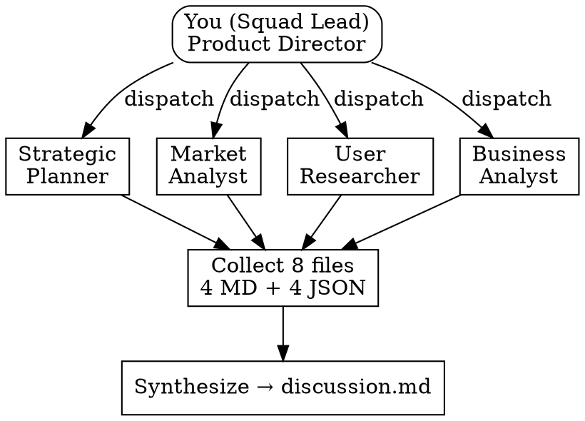

# Phase 1: Strategy & Research (hw-pm-research)

## Overview

This skill runs Phase 1 of the hw-pm workflow. You act as **Squad Lead**, dispatching 4 specialized research subagents in parallel. Each agent produces structured output (Markdown + JSON) with confidence-annotated data. After collection, you synthesize findings, identify contradictions, and write the discussion document.

**Self-contained dispatch:** This skill includes everything needed to construct, dispatch, and collect from 4 parallel subagents. No external patterns or libraries required.

## When to Use

- Spec is complete (`hw-pm-spec` hard gate passed)
- Project has a valid `project.yaml` with all thresholds defined
- No research artifacts exist yet in `phase_1_strategy/`

**Don't use when:**
- Spec has unresolved ambiguity (run `hw-pm-clarify` first)
- Research output files already exist (run `hw-pm-review` instead)
- You only need one analysis (use individual subagent prompt directly)

## Architecture



## Agent Specifications

| Agent | Tools | Read Access | Output | Files |
|-------|-------|-------------|--------|-------|
| **Strategic Planner** | none | project.yaml, company.yaml | Markdown | strategy_alignment.md |
| **Market Analyst** | web_search, read_file | project.yaml, company.yaml, product_line.yaml | Markdown + JSON | competitive_analysis.md + .json |
| **User Researcher** | none | project.yaml, company.yaml | Markdown + JSON | user_research.md + .json |
| **Business Analyst** | financial_calc, read_file | project.yaml, company.yaml | Markdown + JSON | business_case.md + .json |

### Tool Descriptions

- **web_search** — search the web for competitor info, market data, pricing
- **read_file** — read config files from project directory
- **financial_calc** — calculate NPV, IRR, breakeven, payback given cash flow inputs

### Output Files

All output files go into `artifacts/phase_1_strategy/`.

## Subagent Prompt Construction

Each subagent's prompt must be self-contained: include ALL context they need, no more.

```markdown
## Prompt Template

Role: {Agent Role Name}

Context (READ ONLY — do not modify):
- Project: {project_name}
- Description: {project.description}
- Company strategy: {company.strategy_points}
- Price band: {product_line.default_price_band if set}
- Key competitors: {product_line.key_competitors if set}

Your task: Produce {output type} per the mandatory sections below.

Output path: artifacts/phase_1_strategy/{filename}

Mandatory sections:
{per-agent sections}

Task completion checklist (pass ALL before returning):
{per-agent checklist}
```

### Agent-Specific Mandatory Sections

**Strategic Planner:**
```
## 1. Strategic Fit Score (1-5)
## 2. Product Roadmap Impact
## 3. Portfolio Cannibalization Risk (table)
## 4. Strategic Risks (≥2)
## Summary with Recommendation
```

**Market Analyst:**
```
## 1. Competitive Analysis (table: ≥3 competitors, name/price/features/positioning/confidence/source)
## 2. Market Sizing (TAM + SAM + SOM, each with value/unit/confidence/source)
## 3. Market Trends (≥3, each with trend/impact/confidence/source)
## Key Recommendations
```

**User Researcher:**
```
## 1. User Personas (≥2, each with demographics/goals/frustrations/context)
## 2. Pain Points (≥3, ranked by severity+frequency)
## 3. Jobs-to-be-Done (≥3)
```

**Business Analyst:**
```
## 1. Unit Economics Model (ASP, channel cost, BOM, gross margin)
## 2. Bill of Materials (≥5 line items, each with cost+confidence+source)
## 3. Three-Year Financial Projection (table by year)
## 4. NPV + IRR + Breakeven + Payback Period
```

### Agent-Specific Checklists

**Market Analyst self-check before returning:**
```
[ ] ≥3 competitors in comparison table
[ ] TAM + SAM + SOM with NUMERIC values
[ ] Every data point has confidence + source annotation
[ ] Market trends ≥3 with impact assessment
[ ] JSON file written alongside Markdown
```

**Business Analyst self-check before returning:**
```
[ ] BOM with ≥5 line items
[ ] Gross margin calculation present
[ ] NPV + IRR both calculated
[ ] Breakeven units + payback period
[ ] All monetary values in consistent currency+unit
[ ] JSON file written alongside Markdown
```

**User Researcher self-check before returning:**
```
[ ] ≥2 personas (each with 4 sections: demographics, goals, frustrations, context)
[ ] Pain points table with severity + frequency
[ ] JTBD ≥3
[ ] JSON file written alongside Markdown
```

**Strategic Planner self-check before returning:**
```
[ ] Strategic fit score (1-5) provided
[ ] Roadmap impact section present
[ ] Cannibalization table with ≥2 existing products assessed
[ ] Risks ≥2 listed
```

## Dispatch Pattern

### Step 1: Proactive Trigger

After reading this skill and confirming the spec is complete, **proactively take one of these actions**:

**Option A — Auto-dispatch (recommended):** Announce and dispatch immediately:
```
"Phase 1 spec is complete. Dispatching 4 research agents in parallel:
 1. Strategic Planner — strategy alignment
 2. Market Analyst — competitive analysis + market sizing
 3. User Researcher — personas + pain points
 4. Business Analyst — BOM + unit economics + NPV/IRR
All agents are independent and run concurrently."
Then dispatch all 4 without waiting for user response.
```

**Option B — Confirm first:** If the project is high-stakes or the user explicitly requested oversight:
```
"Spec is ready. 4 research agents are prepared to launch:
 • Strategic Planner  (strategy alignment)
 • Market Analyst     (competitive analysis + market sizing)
 • User Researcher    (user personas + pain points)
 • Business Analyst   (BOM + unit economics + NPV/IRR)
Estimated parallel runtime depends on agent complexity.
Dispatch now? [Y/n]"
```

**Prefer Option A** unless the user has expressed a desire to review every step.

### Step 2: Subagent Dispatch Code

Use the platform's subagent mechanism to dispatch all 4 in parallel. Each subagent receives ONLY its own prompt — no shared context, no cross-contamination.

```python
# Pseudocode: dispatch 4 subagents concurrently
# Replace with your platform's actual subagent/Task API

dispatch_prompts = {
    "Strategic Planner":  build_prompt("prompts/strategic-planner.md",   project_config),
    "Market Analyst":     build_prompt("prompts/market-analyst.md",      project_config),
    "User Researcher":    build_prompt("prompts/user-researcher.md",     project_config),
    "Business Analyst":   build_prompt("prompts/business-analyst.md",    project_config),
}

# All 4 run in parallel — non-blocking
results = parallel_dispatch(dispatch_prompts)
# results = {
#   "Strategic Planner":  "strategy_alignment.md content",
#   "Market Analyst":     "competitive_analysis.md + .json content",
#   "User Researcher":    "user_research.md + .json content",
#   "Business Analyst":   "business_case.md + .json content",
# }
```

Implementation notes per platform:
- **OpenCode:** Use `Task` tool with `subagent_type: general`, passing the assembled prompt
- **Claude Code:** Use `Task` tool, one call per agent
- **Others:** Use the platform's parallel agent/thread mechanism

### Step 3: Subagent Isolation Rules

Each subagent prompt is **self-contained** — it includes:
- The agent's role definition
- All project context it needs (config values, not the whole file)
- Mandatory sections and output format
- Self-check checklist

Each subagent does NOT receive:
- Other agents' prompts or outputs
- This skill document
- Conversation history from previous phases

This isolation is critical. It prevents context pollution and ensures independent findings that can be meaningfully cross-referenced during synthesis.

## Data Confidence Specification

Every numeric data point across all agents MUST follow:

```json
{
  "value": <number>,
  "unit": "<string>",
  "confidence": "high" | "medium" | "low",
  "source": "<traceable citation, URL, or method>"
}
```

Confidence levels:
| Level | Meaning | Typical Sources |
|-------|---------|-----------------|
| high | Verified, reliable | Official pricing, datasheets, published reports |
| medium | Reasonable estimate | Industry averages, derived calculations, single source |
| low | Informed guess | Assumptions, analogies, uncited estimates |

## Contradiction Resolution Protocol

When synthesis reveals contradictions between agents:

1. **Data-driven** — compare confidence levels and sources of both claims
2. **Threshold judgment** — if one claim violates a hard config threshold, that claim is rejected
3. **Escalate to user** — if both have equal confidence or the contradiction is strategic, document both sides and present to the user

Common contradiction patterns:

| Pattern | Example | Resolution |
|---------|---------|------------|
| Positioning conflict | Market says "smart device", user says "precision tool" | Clarify with user (hw-pm-clarify) which positioning is correct |
| Price conflict | Business assumes $400 ASP, market shows competitor at $299 | Compare price sensitivity data; if unavailable, escalate |
| BOM vs features | Market requires 4K sensor, BOM can't support it | Flag as trade-off for user; recalculate margin at both configs |

## Output Collection & Synthesis

After all 4 agents return:

1. **Verify file presence** — 8 files (4 MD + 4 JSON) exist
2. **Read all outputs** — understand each agent's key findings
3. **Build confidence matrix** — table of each analysis's confidence and quality
4. **Identify contradictions** — cross-reference findings
5. **Write discussion.md** — using the template from `hw-pm-review` (call that skill next)

## Common Mistakes

**Incomplete prompts:** "Market analyst, do market analysis." → Agent lacks context and produces generic output. Use the prompt template every time.

**Context leakage:** Sharing other agents' outputs before synthesis. → Agents should work independently. Only you see all 4.

**Sequential dispatch:** Running agents one-by-one instead of parallel. → Eliminates the entire benefit of the squad model.

**No agent isolation:** One agent's failure crashes others. → Each task is independent; a failed agent can be retried alone.

**Missing confidence annotation:** Output has data but no confidence. → That data is unusable in review and gate. Enforce the self-check.
