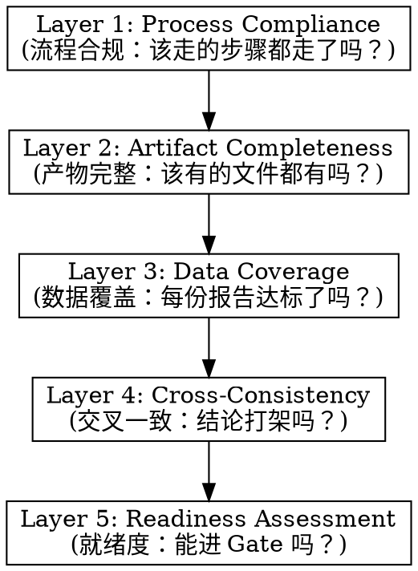

# Cross-Agent Review (hw-pm-review)

## Overview

This skill runs a **5-layer completeness review** on Phase 1 outputs before the formal gate decision. It catches missing data, contradictions, and quality issues that would invalidate a gate score.

`hw-pm-review` answers: *"Is the data ready for a decision?"*  
`hw-pm-gate` answers: *"Is the product worth investing in?"*

These are separate. A review that fails means the gate cannot meaningfully execute.

## When to Use

- All 4 agents returned from `hw-pm-research`
- 8 output files (4 MD + 4 JSON) exist in `phase_1_strategy/`
- No review exists yet (no `discussion.md`)

**Don't use when:**
- Research is still running (wait for completion)
- Research was rejected by a previous review and conditions not met
- You want a formal investment decision (use `hw-pm-gate`)

## The 5-Layer Review



Each layer is a checklist. All items in a layer must pass before proceeding to the next layer.

### Layer 1 — Process Compliance

Check that the workflow was followed correctly:

```
[ ] project.yaml exists and has all required fields
[ ] company.yaml exists with investment thresholds
[ ] product_line.yaml exists (or explicitly N/A)
[ ] hw-pm-research was executed (4 agents dispatched)
[ ] All 4 agents returned without crash or timeout
[ ] If re-review: previous conditions were addressed
```

### Layer 2 — Artifact Completeness

Check that all required files exist:

```
[ ] strategy_alignment.md          present
[ ] competitive_analysis.md        present
[ ] competitive_analysis.json      present
[ ] user_research.md               present
[ ] user_research.json             present
[ ] business_case.md               present
[ ] business_case.json             present

[ ] All JSON files parse as valid JSON
[ ] All MD files are non-empty (>100 chars each)
```

### Layer 3 — Data Coverage

Check minimum content requirements per agent:

**Strategic Alignment:**
```
[ ] Strategic fit score (1-5) present
[ ] Roadmap impact section present
[ ] Cannibalization table with ≥2 products
[ ] Risks ≥2 listed
```

**Competitive Analysis:**
```
[ ] TAM with value + unit + confidence + source
[ ] SAM with value + unit + confidence + source
[ ] SOM with value + unit + confidence + source
[ ] Competitors ≥3 in table
[ ] Market trends ≥3
```

**User Research:**
```
[ ] Personas ≥2 with all 4 sections each
[ ] Pain points ≥3 with severity + frequency
[ ] JTBD ≥3
```

**Business Case:**
```
[ ] BOM with ≥5 line items
[ ] Gross margin calculated
[ ] NPV + IRR calculated
[ ] Breakeven units + payback period present
[ ] 3-year financial projection table
```

### Layer 4 — Cross-Consistency

Compare findings across agents:

```
[ ] Market pricing range ↔ Business ASP — consistent?
[ ] User persona profiles ↔ Strategic positioning — aligned?
[ ] Competitor features ↔ BOM allocation — plausible?
[ ] Confidence levels across agents — no systematic overconfidence?
```

**Overconfidence Detection (MANDATORY):**

Count all data points that claim "high" confidence but cite derived calculations, industry averages, or assumptions (rather than published reports, official pricing, datasheets).

If ≥30% of "high" confidence data points fall into this category → flag as **"Systematic Overconfidence Risk"**. This means the analysis reads as more certain than it actually is. The gate decision based on this data will give a false sense of precision. Output MUST state: "Data appears more confident than sourcing warrants. Review confidence annotations before gate."

For each inconsistency, document:
- Which agents disagree
- The specific data points
- Confidence levels of each
- Severity (Blocking / Concerning / Minor)

### Layer 5 — Readiness Assessment

Synthesize all findings into one of three judgments:

| Judgment | Meaning | Next Step |
|----------|---------|-----------|
| **REJECT** | Critical data gaps or contradictions block any meaningful decision | Return to `hw-pm-research` with specific remediation requirements |
| **CONDITIONAL** | Data mostly sufficient, but specific gaps need user acknowledgment | Proceed to gate with condition list; gate must document user response |
| **APPROVE** | All layers pass, data is ready for investment decision | Proceed to `hw-pm-gate` |

### REJECT Conditions

REJECT when any of these is true:
- Layer 1-2 any FAIL (process or artifacts incomplete)
- Layer 3 missing critical data (no TAM, no NPV, no personas)
- Layer 4 has blocking contradiction (positioning fundamentally ambiguous)

### CONDITIONAL Conditions

CONDITIONAL when:
- Layer 3 has minor gaps (e.g., SOM confidence "low" but TAM+SAM solid)
- Layer 4 has non-blocking inconsistency (minor price range disagreement)
- All critical data present but key assumptions unverified

## Output Format

Write `artifacts/phase_1_strategy/discussion.md` with this structure:

```markdown
# Phase 1 Synthesis: {project_name}

## Executive Summary
{APPROVE/CONDITIONAL/REJECT} with conditions (if any)

## 1. Analysis Completeness & Confidence Scores
| Analysis | Confidence | Quality | Key Strength | Key Weakness |

## 2. Identified Data Gaps
### GAP N: {Title} (PRIORITY)
- Missing: {what's missing}
- Impact: {why it matters}
- Assumption: {current assumption if any}

## 3. Contradictions & Tensions
### CONTRADICTION N: {Title}
- {Agent A} says: {finding}
- {Agent B} says: {finding}
- Tension: {why this matters}

## 4. Key Assumptions Requiring Verification
Table: Assumption, Source, Confidence, Risk if Wrong, Verification Needed

## 5. Investment Threshold Assessment
Table: Criterion, Current State, Minimum Threshold, Status

## 6. Recommendation
{REJECT / CONDITIONAL / APPROVE}
{Rationale}
{Conditions if any}
```

## Common Mistakes

**Skipping layers:** Jumping from Layer 1 to Layer 5 because "the outputs look good." → Each layer catches different issues. Run them in order.

**Mixing review with gate:** Review finds a data gap and immediately says "Go/No-Go." → Review assesses data readiness, not investment worthiness. Those are separate decisions.

**Ignoring confidence:** "The TAM looks right, let's pass." → A high TAM with low confidence should be CONDITIONAL, not APPROVE.

**Vague conditions:** "Need more data." → Each condition must specify: what's needed, who provides it, and what "done" looks like.

**Blocking on minor inconsistencies:** "Analysts disagree by $5 on BOM for one component." → Weigh severity. Not every inconsistency is blocking.
