# Hardware Product Management System (hw-pm)

## Overview

Hardware product management treats products as **investments**. Each initiative follows a structured lifecycle of phases and gates. Every phase produces decision-grade data; every gate applies quantified criteria before capital is committed.

This skill is the **entry point** to the hw-pm skill system. It does no research itself—it inspects project state and routes to sub-skills.

The system has **18 skills**: 17 convergent (narrowing toward decisions) and 1 divergent (`hw-pm-explore`, widening the possibility space before converging).

## When to Use

- **New product assessment** — one-line product idea, no config yet
- **Project status check** — "where is my project?"
- **Phase completion routing** — "Phase 1 outputs are done, what next?"
- **Mid-workflow entry** — "I have outputs but need review"

**Don't use when:**
- You already know which sub-skill applies (call it directly)
- The task is single-agent research (use `dispatching-parallel-agents`)

## The 18-Skill System

```dot
digraph hw_pm_system {
    rankdir=LR;
    node [shape=box, style=rounded];
    phase2 [style=dashed, color=green];
    phase3 [style=dashed, color=orange];
    phase4 [style=dashed, color=purple];
    phase5 [style=dashed, color=red];
    cross [style=dashed, color=gray];
    reportnode [style=dashed, color=teal];

    entry [label="hw-pm (entry)", shape=doublecircle];
    init [label="hw-pm-init"];
    spec [label="hw-pm-spec"];
    clarify [label="hw-pm-clarify", style=dashed, color=blue];
    explore [label="hw-pm-explore\n(divergent)", style=dashed, color=blue];
    research [label="hw-pm-research\n(4 subagents)"];
    review [label="hw-pm-review\n(5 layers)"];
    gate [label="hw-pm-gate\n(5 dimensions)"];
    analyze [label="hw-pm-analyze", style=dashed, color=blue];

    prd [label="hw-pm-prd", style=dashed, color=green];
    design [label="hw-pm-design-review", style=dashed, color=orange];
    proto [label="hw-pm-prototype", style=dashed, color=purple];
    cert [label="hw-pm-cert", style=dashed, color=purple];
    npi [label="hw-pm-npi", style=dashed, color=red];
    launch [label="hw-pm-launch", style=dashed, color=red];
    cost [label="hw-pm-cost", style=dashed, color=gray];
    triage [label="hw-pm-triage", style=dashed, color=gray];
    report [label="hw-pm-report", style=dashed, color=teal];

    entry -> init [label="no config", color=red];
    entry -> spec [label="has config"];
    init -> entry;
    spec -> clarify;
    clarify -> explore;
    spec -> explore;
    explore -> research [label="PM confirms"];
    spec -> research [label="skip explore", style=dashed];
    clarify -> research [label="skip explore", style=dashed];
    research -> review;
    review -> research [label="REJECT", color=red, style=dashed];
    review -> gate [label="APPROVE/CONDITIONAL"];
    gate -> analyze;
    gate -> entry [label="No-Go", color=red];
    gate -> prd [label="Go → Phase 2", color=green];
    analyze -> entry;
    prd -> design;
    design -> proto;
    proto -> npi;
    npi -> launch;
    launch -> report;
    report -> entry [label="EOL"];
    proto -> cert [style=dashed, label="parallel"];
    cert -> npi;
    cost -> prd [style=dashed, label="parallel"];
    cost -> design;
    cost -> proto;
    cost -> npi;
    cost -> launch;
    triage -> prd [style=dashed, label="parallel"];
    triage -> design;
    triage -> proto;
    triage -> npi;
    triage -> launch;
}
```



| Skill | Phase | Type | Input | Output |
|-------|-------|------|-------|--------|
| `hw-pm-init` | — | Entry | Project idea | Config templates, dir structure |
| `hw-pm-spec` | 1 | Required | Config files | project.yaml, thresholds, SDD |
| `hw-pm-clarify` | 1 | Optional | Ambiguous spec | Clarified spec |
| `hw-pm-explore` | 1 | Optional | Clear spec | Possibility landscape, enriched framing |
| `hw-pm-research` | 1 | Required | Spec + config | 4x MD + 4x JSON |
| `hw-pm-review` | 1 | Required | Research outputs | discussion.md, readiness |
| `hw-pm-gate` | 1 | Required | Review + outputs | gate_review.md, Go/No-Go |
| `hw-pm-analyze` | 1 | Optional | Gate outputs | audit_report.md |
| `hw-pm-prd` | 2 | Required | Phase 1 outputs | PRD, tech spec, feature matrix |
| `hw-pm-design-review` | 3 | Required | PRD | Design scorecard, freeze sign-off |
| `hw-pm-prototype` | 4 | Required | Design freeze | EVT/DVT/PVT reports, defect trend |
| `hw-pm-cert` | 4 | Optional | Design freeze | Cert matrix, compliance declaration |
| `hw-pm-npi` | 5 | Required | PVT sign-off | NPI checklist, ramp plan |
| `hw-pm-launch` | 5 | Required | NPI complete | Launch plan, channel strategy |
| `hw-pm-cost` | 2-5 | Cross-phase | BOM data | Should-cost, cost roadmap |
| `hw-pm-triage` | 2-5 | Cross-phase | Issues, risks | Risk register, issue tracker, ECO log |
| `hw-pm-report` | — | Report | All artifacts | Integrated report (摘要/标准/详细) |

## State Machine & Routing

```
Check project state in order:

→ project.yaml present?            NO  ──  hw-pm-init
                                       YES ──  read phase_status from project.yaml

→ phase_status: phase_1 (or absent) ──  check Phase 1 artifacts:
    → phase_1_strategy/*.md exist?  NO  ──  check config state:
                                         → config exists but spec ambiguous? → hw-pm-clarify
                                         → config incomplete/missing?        → hw-pm-spec
                                         → config complete, spec clear?     → offer hw-pm-explore or research
                                         YES ──  hw-pm-research
    → discussion.md present?        NO  ──  hw-pm-review
    → gate_reviews/*.md present?    NO  ──  hw-pm-gate
    → last gate result:
        Go     ──  set phase_status: phase_2, route hw-pm-prd
        No-Go  ──  hw-pm-report (if user wants summary even for No-Go)

→ phase_status: phase_2 ──  hw-pm-prd (PRD complete → set phase_status: design)
→ phase_status: design  ──  hw-pm-design-review (freeze → set phase_status: validate)
→ phase_status: validate ──  hw-pm-prototype + hw-pm-cert (parallel)
                            (PVT complete → set phase_status: manufacturing)
→ phase_status: manufacturing ──  hw-pm-npi (NPI complete → set phase_status: launch)
→ phase_status: launch     ──  hw-pm-launch (launch complete → set phase_status: eol)

→ phase_status: eol ──  hw-pm-report (project complete, generate final report)
    After report generated → prompt: "Any updates needed, or close project?"

Cross-phase and report skills run on demand:
→ hw-pm-report — load at any point for interim stakeholder reports
→ hw-pm-cost — load when BOM cost needs tracking or update
→ hw-pm-triage — load when risk/issue/ECO management needed
```

## Role Glossary

| Role | Phase | Responsibility | Maps To |
|------|-------|---------------|---------|
| **Product Director** | All | Phase scheduling, gate review, final decision | Current agent (you) |
| **Project Manager** | All | Timeline, risk register, state tracking | Current agent (you) |
| **Strategic Planner** | 1 | Company alignment, portfolio impact | Subagent |
| **Market Analyst** | 1 | Competitive analysis, TAM/SAM/SOM | Subagent |
| **User Researcher** | 1 | Personas, pain points, JTBD | Subagent |
| **Exploration Guide** | 1 | Adjacent possibilities, cross-industry analogy, tech trend scan | Current agent (you) |
| **Business Analyst** | 1 | BOM, unit economics, NPV/IRR | Subagent |
| **Product Manager** | 2 | PRD, technical spec, feature prioritization | Current agent (you) |
| **Design Lead** | 3 | Industrial/mechanical/electrical/firmware design | Current agent (you) |
| **Test Lead** | 4 | EVT/DVT/PVT test planning and execution | Current agent (you) |
| **Compliance Lead** | 4 | Certification matrix, regulatory testing | Current agent (you) |
| **NPI Lead** | 5 | Supplier readiness, pilot run, ramp | Current agent (you) |
| **Cost Engineer** | 2-5 | Should-cost analysis, BOM cost-down | Current agent (you) |
| **Risk Manager** | 2-5 | Risk register, issue triage, ECO tracking | Current agent (you) |
| **Report Writer** | — | Consolidate artifacts into human-readable reports | Current agent (you) |

## Hard Gates

```
Phase 1:
  Spec not complete          → Gate closes before research
  Research outputs missing   → Gate closes before review
  Review not APPROVE         → Gate closes before decision

Phase 2:
  PRD not complete           → Gate closes before design

Phase 3:
  Design freeze not signed   → Gate closes before prototype

Phase 4:
  PVT not passed             → Gate closes before NPI
  Cert not complete          → CONDITIONAL for NPI

Phase 5:
  NPI checklist not green    → Gate closes before launch
  Launch plan not confirmed  → No product shipment
```

## Common Mistakes

**Skipping review:** "Research looks good, go straight to gate." → Review catches data gaps that gate scoring would miss.

**Over-routing:** "I know this needs research, skip hw-pm." → hw-pm detects missing config that would break research.

**Ignoring state:** Running review before all 8 output files exist. → Always check artifact presence first.

**Skipping init:** Manually creating files instead of using hw-pm-init. → hw-pm-init ensures complete schema, correct commentary, and proper directory structure. Manual files often miss fields that downstream skills depend on.

**Generating reports mid-phase:** Running hw-pm-report before Phase 1 is complete. → Report skill scans for existing artifacts. If only Phase 1 data exists, report will be Phase 1 only — which may mislead readers into thinking the project is complete.
