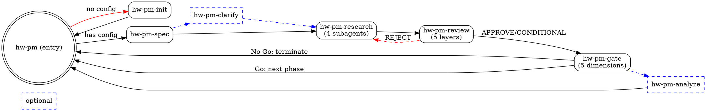

# Hardware Product Management System (hw-pm)

## Overview

Hardware product management treats products as **investments**. Each initiative follows a structured lifecycle of phases and gates. Every phase produces decision-grade data; every gate applies quantified criteria before capital is committed.

This skill is the **entry point** to the hw-pm skill system. It does no research itself—it inspects project state and routes to sub-skills.

## When to Use

- **New product assessment** — one-line product idea, no config yet
- **Project status check** — "where is my project?"
- **Phase completion routing** — "Phase 1 outputs are done, what next?"
- **Mid-workflow entry** — "I have outputs but need review"

**Don't use when:**
- You already know which sub-skill applies (call it directly)
- The task is single-agent research (use `dispatching-parallel-agents`)

## The 8-Skill System



| Skill | Type | Input | Output |
|-------|------|-------|--------|
| `hw-pm-init` | Entry | Project idea | Config templates, dir structure |
| `hw-pm-spec` | Required | Config files | project.yaml, thresholds, SDD |
| `hw-pm-clarify` | Optional | Ambiguous spec | Clarified spec |
| `hw-pm-research` | Required | Spec + config | 4x MD + 4x JSON |
| `hw-pm-review` | Required | Research outputs | discussion.md, readiness |
| `hw-pm-gate` | Required | Review + outputs | gate_review.md, Go/No-Go |
| `hw-pm-analyze` | Optional | Gate outputs | audit_report.md |

## State Machine & Routing

```
Check artifacts in order:

→ project.yaml present?            NO  ──  hw-pm-init (create config templates)
                                      YES ──  continue
→ phase_1_strategy/*.md exist?     NO  ──  check clarify need
                                      YES ──  hw-pm-research
→ discussion.md present?           NO  ──  hw-pm-review
→ gate_reviews/*.md present?       NO  ──  hw-pm-gate
→ All present → read last gate result:
    Go  ──  next phase (future skill)
    No-Go ──  terminate with report
```

## Role Glossary

| Role | Responsibility | Maps To |
|------|---------------|---------|
| **Product Director** | Phase scheduling, gate review, final decision | Current agent (you) |
| **Project Manager** | Timeline, risk register, state tracking | Current agent (you) |
| **Strategic Planner** | Company alignment, portfolio impact | Subagent |
| **Market Analyst** | Competitive analysis, TAM/SAM/SOM | Subagent |
| **User Researcher** | Personas, pain points, jobs-to-be-done | Subagent |
| **Business Analyst** | BOM, unit economics, NPV/IRR | Subagent |

## Hard Gates

```
Spec not complete          → Gate closes before research
Research outputs missing   → Gate closes before review
Review not APPROVE         → Gate closes before decision
```

## Common Mistakes

**Skipping review:** "Research looks good, go straight to gate." → Review catches data gaps that gate scoring would miss.

**Over-routing:** "I know this needs research, skip hw-pm." → hw-pm detects missing config that would break research.

**Ignoring state:** Running review before all 8 output files exist. → Always check artifact presence first.

**Skipping init:** Manually creating files instead of using hw-pm-init. → hw-pm-init ensures complete schema, correct commentary, and proper directory structure. Manual files often miss fields that downstream skills depend on.
